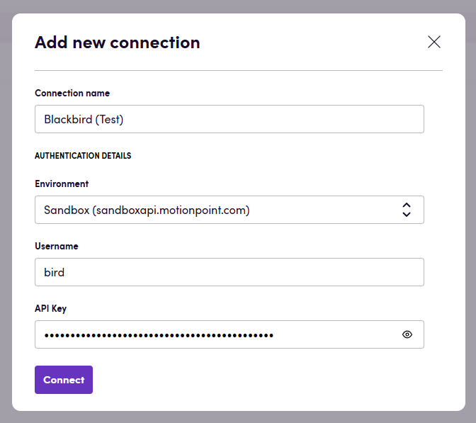

# Blackbird.io MotionPoint

Blackbird is the new automation backbone for the language technology industry. Blackbird provides enterprise-scale automation and orchestration with a simple no-code/low-code platform. Blackbird enables ambitious organizations to identify, vet and automate as many processes as possible. Not just localization workflows, but any business and IT process. This repository represents an application that is deployable on Blackbird and usable inside the workflow editor.

## Introduction

<!-- begin docs -->

MotionPoint offers a platform and services to translate and localize websites with AI-driven technology and human quality assurance.

## Translation mechanism

MotionPoint uses an asynchronous translation approach where submitted content is not translated immediately but processed in the background. The app is built around a polling concept:

1. Create a translation job by uploading a file, receive a Job ID
2. Poll the job status periodically until completion
3. Once the job is complete (and an event is emitted), your translated file is ready

This workflow ensures efficient processing of translation requests while allowing you to track progress throughout the translation process.

## Prerequisites for Setup

Before connecting your MotionPoint instance to Blackbird, please ensure you have the following requirements:

- **Environment Information**: Determine whether you will connect to the sandbox (testing) or production environment
- **API Username**: Obtain a valid API username for your selected environment
- **API Key**: Secure the corresponding API key for your API user account

## Connecting

1. Navigate to apps and search for **MotionPoint**
2. Click _Add Connection_
3. Name your connection for future reference e.g., 'My MotionPoint'
4. Fill in the following fields:
   - **Environment**: Select your environment (Sandbox or Production)
   - **Username**: Your username for accessing the MotionPoint Developer API
   - **API Key**: Your API key for accessing the MotionPoint Developer API
5. Click _Connect_
6. Confirm that the connection has appeared and the status is _Connected_

## Actions

- **Search jobs**: "Search available jobs based on the provided criteria.
- **Get job**: Retrieve details of a specific job by its ID.
- **Create job (upload file)**: Create a new translation job with the specified details.
- **Download target file**: Download the translated file for a specific job.
- **Cancel job**: Cancel a specific job by its ID.

## Events

- **On job completed**: Polling event that periodically checks for job completion. When a job is completed, it emits an event with the job details and the translated file.

> Building a simple workflow with MotionPoint requires just two components: the 'Create job (upload file)' action to submit content for translation, and the 'On job completed' event to receive the translated result. Note that using the 'Download target file' action is optional, as the translated file is already included in the event output when a job completes.

## Example

### Content Translation Workflow: Contentful to MotionPoint Integration

This example demonstrates an automated content translation workflow between Contentful CMS and MotionPoint:

1. **Event**: When a new entry is published in Contentful
    - Optional filtering available to select only entries with specific tags (e.g., "Ready for translation")

2. **Process**: 
    - Download the entry content from Contentful
    - Create a translation job in MotionPoint using the "Create job" action
    
3. **Completion**:
    - The "On job completed" event detects when MotionPoint finishes the translation
    - Retrieve the translated file automatically
    - Upload the translated content back to Contentful

This integration enables seamless content localization without manual file transfers between your CMS and translation service.

## Feedback

Do you want to use this app or do you have feedback on our implementation? Reach out to us using the [established channels](https://www.blackbird.io/) or create an issue.

<!-- end docs -->
